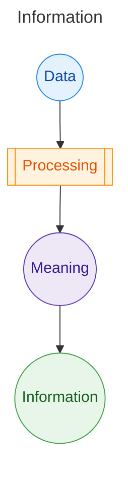
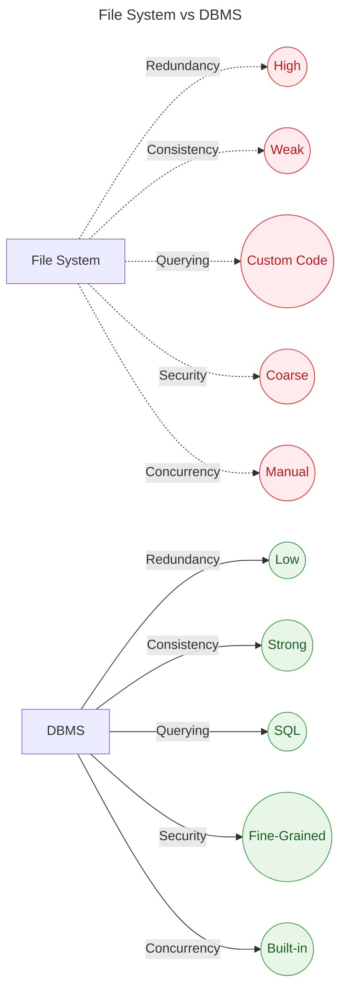

# Introduction to DBMS

## Data vs Information

### Data
- Data is a collection of raw bytes stored as bits/bytes—text, numbers, images, etc.
- Raw data by itself has no inherent meaning; unprocessed data is not directly useful.

### Information
- When raw data is processed into a structured form to derive meaning, it becomes information.
- Standard definition: Information is processed data that supports decision-making.
- Example (social media strategy):
  - A business collects post performance data across platforms; raw metrics alone are not meaningful.
  - After analysis, they find Instagram yields the most likes (processing).
  - They conclude:
    1. Stop posting on less relevant platforms like LinkedIn for this campaign.
    2. Focus on Instagram with entertainment-oriented posts.
  - These actionable conclusions are information.

Caption: Data → Processing → Meaning → Information


## Database and DBMS

### Database
- A database is an electronic system that stores data in a structured way so it can be easily accessed, managed, and updated.

### DBMS (Database Management System)
- Split into two parts: DB + MS.
  - DB: Stores inter-related data.
  - MS: Set of programs to perform operations:
    - Access
    - Add
    - Update
    - Delete
- Conclusion: A DBMS is a collection of data plus programs to manipulate that data efficiently.
- It acts as an interface between the data and the user.

## Why Use a DBMS Instead of a File System? ✅

File systems are not easily extensible or scalable for complex, evolving requirements.

### Bank Example (Savings vs Current Accounts)
- Initially, a bank implements savings account logic (interest, current balance, monthly statements).
- Years later, it adds current accounts (0 interest, quarterly/annual statements).
- Because requirements were not anticipated, developers must rewrite logic for new account types—leading to duplicated code and inconsistencies.

## Problems with File Systems

- Data Redundancy and Inconsistency  
  - If a customer opens both savings and current accounts, personal details may be stored twice (two places), leading to redundancy.  
  - If details are updated in one file but not the other, data becomes inconsistent.

- Difficulty in Accessing Data  
  - Queries like “all customers with a common PIN code” require new programs if not anticipated, making access slow and difficult.

- Data Isolation  
  - Different programmers might use different file formats, making data harder to combine and analyze.

- Integrity Problems  
  - Integrating new rules is hard.  
  - Example: Minimum balance changes from ₹10,000 to ₹20,000—every debit check across programs must be updated consistently.

- Atomicity Problem  
  - Some operations must happen entirely or not at all (all-or-nothing).  
  - Example: Money transfer—debit in one account must pair with credit in another; partial updates are unacceptable. Easier in DBMS via transactions.

- Concurrency Anomalies  
  - Two people debiting the same account at the same time via different channels (ATM + UPI) can cause race conditions.  
  - Coordinating “one request at a time” is complex with file systems; DBMS provides locks/transactions.

- Security  
  - Fine-grained access control (different roles/privileges) is difficult to implement across file programs; DBMS supports roles, privileges, and views.

## India-Relevant Examples 💡

- UPI Transfer (Atomicity):  
  - A transfer from PhonePe to bank must either fully debit and credit or fail completely—handled by DBMS transactions.
- Aadhaar KYC (Redundancy):  
  - Centralized KYC reduces repeated storage of personal details across branches and products.
- IRCTC (Concurrency):  
  - Seat booking must prevent double-booking during peak Tatkal—handled by locking and isolation levels.
- DigiLocker (Security):  
  - Access roles for citizen, issuer, and verifier enforced via DBMS permissions.
- Bank Minimum Balance Rule (Integrity):  
  - Changing min balance policy applies uniformly via DB constraints and triggers instead of scattered code edits.

## How DBMS Solves These Problems

- Eliminates redundancy via normalization and centralized schemas.
- Ensures consistency with constraints (PRIMARY KEY, UNIQUE, CHECK), triggers, and ACID transactions.
- Simplifies access using SQL for ad-hoc queries.
- Reduces isolation issues by standardizing storage and schema.
- Enforces integrity with declarative constraints and referential integrity.
- Provides atomicity, consistency, isolation, durability (ACID).
- Manages concurrency via locks, MVCC, and isolation levels.
- Enhances security with roles, privileges, views, and auditing.

Caption: File System vs DBMS Capabilities


## Key Terms (Standard definitions)

- Data: Raw facts represented as bits/bytes; lacks context.
- Information: Processed data that conveys meaning for decisions. (standard definition)
- Database: Organized collection of related data.
- DBMS: Software that manages databases, enabling CRUD operations, transactions, security, and recovery.
- ACID:
  - Atomicity: All-or-nothing execution of a transaction.
  - Consistency: Preserves database rules before/after transactions.
  - Isolation: Concurrent transactions do not interfere.
  - Durability: Committed changes survive failures.

## FAQ (Short)

- Is a spreadsheet a database?  
  - It can store data but lacks full DBMS features like ACID transactions, concurrency control, and robust security.  
- Does DBMS remove all redundancy?  
  - It reduces redundancy through design; some controlled redundancy may be kept for performance.  
- Are file systems obsolete?  
  - No, they store files; DBMS sits atop file systems to manage structured data.

## Pitfalls and [Check] Notes

- “File system is not extensible” captures the idea that scaling features requires custom code and is error-prone; more precise phrasing: file systems lack standardized querying, constraints, and transactions compared to DBMS.
- If two programmers use different file formats, integration becomes hard—prefer unified schemas and DBMS-managed formats.
- Atomicity phrasing clarified: “ya toh hogi ya nahi hogi” = all-or-nothing transaction semantics.

## Small SQL Snippet (For Clarity)

```sql
-- Enforcing integrity and minimizing redundancy
CREATE TABLE Customer (
  CustomerID BIGINT PRIMARY KEY,
  Name VARCHAR(100) NOT NULL,
  Aadhaar CHAR(12) UNIQUE,     -- Prevent duplicates
  Pincode CHAR(6)
);

CREATE TABLE Account (
  AccountNo BIGINT PRIMARY KEY,
  CustomerID BIGINT NOT NULL,
  Type ENUM('SAVINGS','CURRENT'),
  Balance DECIMAL(12,2) NOT NULL CHECK (Balance >= 0),
  CONSTRAINT fk_customer FOREIGN KEY (CustomerID) REFERENCES Customer(CustomerID)
);

-- Minimum balance integrity (example check)
ALTER TABLE Account
  ADD CONSTRAINT chk_min_bal CHECK (
    (Type='SAVINGS' AND Balance >= 10000) OR
    (Type='CURRENT' AND Balance >= 0)
  );
```

## Quick Summary

- Data is raw; information is processed and meaningful.  
- Database stores structured data for easy access and updates.  
- DBMS = data + programs to manipulate data efficiently.  
- File systems struggle with redundancy, consistency, and querying.  
- DBMS ensures ACID transactions and integrity constraints.  
- Concurrency control prevents double-booking/duplicate debits.  
- Security via roles and views; auditing supported.  
- Indian examples: UPI, IRCTC, Aadhaar, DigiLocker.  
- Use SQL to query instead of writing new programs.  
- Policy changes enforced centrally via constraints/triggers.

## Rapid Recall

- Can atomicity fail in a file-based transfer?  
- Are integrity rules centralized or scattered in code?  
- Does the system support ad-hoc SQL queries?  
- Will concurrent updates cause race conditions?  
- Are roles/privileges defined at table/view level?

## Most Likely Interview Questions
- Define data vs information with an example; give the standard definition of information.
- Explain why DBMS is preferred over file systems—mention redundancy, consistency, and concurrency.
- What is ACID? Illustrate with a UPI transfer example.
- How do constraints (PRIMARY KEY, UNIQUE, CHECK, FK) improve data quality?
- Describe a scenario of concurrency anomaly and how isolation levels fix it.

## Online Assessment (OA) Practice Questions
- Given a bank schema, identify redundancy and propose normalization steps.
- Write an SQL query to fetch customers by PIN code; discuss indexing impact.
- Classify transactions as atomic/non-atomic and suggest fixes with ACID.
- Choose correct statements about file systems vs DBMS transactions.
- Detect integrity violations when a policy changes; propose schema constraints.
