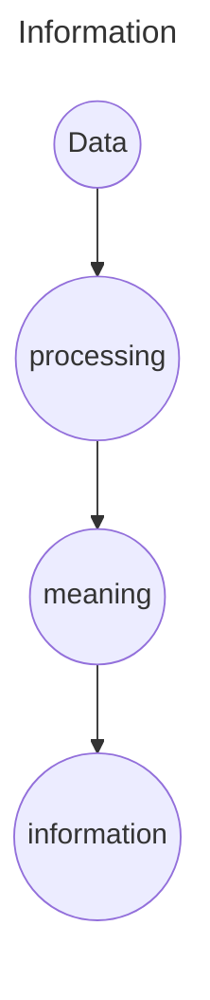

# Introduction to DBMS
## Data
Data is nothing but the collection of row bytes -> as the data is stored in Bits/Bytes
whether it's text, number, image or anything for that matter

Data itself has no meaning as such / unprocessed data has no meaning 
 
### Information
when we process the row data and derive some meaning out of it then it gets converted to __information__
OR
Processed data is known as information -> it is derived from data by applying some conditions and algorithms

**example -** 
if a business want's to expand their social media platform  and they hired a marketing agency which uploads the content on every social media platform and now they have data of performance of posts on different social media platform (this data right now is of no meaning)

now by some processing they came to know that they are getting most number of likes on instagram __processing of data__

and they have concluded that the large chunk of their audience are of those who are into entertainment, and they concluded that

1. They should stop posting things on other serious platforms which are not related to social media like Linkedin 
2. They should focus more on catering audience on insta and to make posts related to entertainment 
(__this is now called as the information__)

## DataBase
Database is an electronic place/system where data is stored in such a way that it can be __easily accessed, managed, and updated__ 

### DBMS
it is into divided into to parts __DB__   __MS__

__DB__ - stores the interlated data
**MS** - set of rpograms by which we can performs operations such as
- Access
- Add
- Update
- Delete
so it can be concluded that DBMS is a collection of data and some set of programs to manipulate that data

It acts as an interface between data and the user

### Why to use DBMS and not file system

because the file system is not extensible 

for example - 

if a bank wants to apply some file system for let's say saving accounts; then they will hire a developer to implement the functionalities like

- interest
- current balance
- monthly statements

now after 10 years the bank want's to add functionalities of current account, now the functionality of the current account are not same the saving accounts like

- the interest is 0
- maybe the user also wants the bank statements quaterly or annually
so again we need to write the functions for the current account like we did in savings account

## Problems which might arouse
-  **Data redundancy and inconsistency**
suppose a user is already having a "Savings account " in that bank and now he also wants to open the " Current Account" so the bank will ask for the personal details but now it will be storing the person's personal details at __two place__ this gives rise to data redundancy
- **Inconsistency**
if a person having 2 accounts and he updates the information in one account but forgets to do that in the second account , this will create data inconsistency
however we can write certain codes to reflect the same thing at both the places but maybe there are different ways in which data is stores in the 2 different file system because the programs were written by 2 different programmers , it will be very typical

- **Difficulty in Accessing in data**
Suppose someone asks for the data of the customer having a common pincode, now the programmer hadn't anticipated that in the beginning so he have to write another program to get that information and do all the required processing so the accessing of data would be very slow and difficult in this case

- **Data Isolation**
maybe both the programmers have used the different file formats to store the data so in this case data isolation would be bad

- **Integrity Problems**
Intergation of new updates or the parameters to the file system is a very hefty task
ex - let's suppose initially the min limit of the current savings account was 10k so we have applied some logics with each debit function to first check the limit and then if it's become less then 10k fail the transaction, but now the updated limit is 20k so now again it would be a very hefty task to integrate this change into a file system
- **Atomicity Problem**
there are somethings which are atomic that means needs to be done in single shot - ya toh hogi ya nahi hogi
jaise aapka account kahi debit hoga toh kahipe credit bhi hoga esa nahi hoga sirf debit hogya paise kho gaye, this is very easy to maintain in DBMS but a cumbersome task in file system
- **Concurrent - access anomalies**
for example to persion is debitting money from the same account at the same time using different modes, so to handle such situations you need to right certain logics like ek time pe ek request should be processed and when that is completed the system should start processing the next one, doing this is very difficult in the file system when compared to DBMS
- **Security**
it is very difficult to control the access rights of data in different level in the file system

### Link to PDFs
